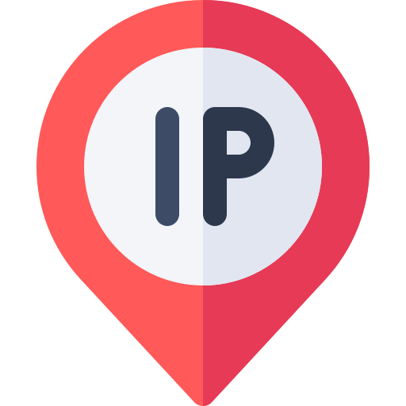

<p align="center">
    
</p>

<h1 align="center">IP Lookup Service 📍</h1>

### Description

The IP Lookup Service is an Node.js, Express.js based API designed to fetch detailed information about a given IP address. By scraping data from the [ip8](https://ip8.com) and leveraging a fallback to the [geoip-lite](https://www.npmjs.com/package/geoip-lite) library, this service provides comprehensive geolocation data and ISP details. It offers both IPv4 and IPv6 support, ensuring robust functionality for a wide range of use cases.

**_Note:_** _: This project is intended for educational and development purposes only._

---

### Deployed URL

[DEMO](https://ip.app3.in)

### Features

1. **Comprehensive Data:** Fetch detailed geolocation and ISP information for a given IP address.
2. **Fallback Mechanism:** Utilizes geoip-lite for geolocation data when external API fails.
3. **Clean Response:** Removes unnecessary data from API responses to ensure clean and relevant results.

### API Endpoint

Access the service via: `/ip/:ipAddress`

### Example Response

```json
{
    "geoip": {
        "city": null,
        "country": "United States",
        "continent": "North America",
        "latitude": 37.751,
        "longitude": -97.822,
        "postalcode": null,
        "region": null,
        "isocode": "US",
        "timezone": "America/Chicago"
    },
    "isp": {
        "autonomousSystemNumber": 15169,
        "autonomousSystemOrganization": "GOOGLE",
        "ipAddress": "8.8.8.8",
        "network": "8.8.8.8/32",
        "isp": "Google",
        "organization": "Google"
    }
}
```

### How to Get IP Address

#### For IPv4:

```javascript
try {
    const res = await axios.get("https://ip4.ip8.com");
    console.log("IPv4:", res.data);
} catch (err) {
    console.log("Failed to fetch IPv4 address:", err);
}
```

#### For IPv6:

```javascript
try {
    const res = await axios.get("https://ip6.ip8.com");
    console.log("IPv6:", res.data);
} catch (err) {
    console.log("Failed to fetch IPv6 address:", err);
}
```

### How to Set Up Locally

1. **Clone Repository:**

    ```bash
    git clone https://github.com/akashvaghela09/ip-lookup-service.git
    ```

2. **Navigate to Repository:**

    ```bash
    cd ip-lookup-service
    ```

3. **Install Packages:**

    ```bash
    npm i
    ```

### How to Run

1. **Start the Server:**
    ```bash
    npm start
    ```

### Contributor

-   [Akash Vaghela](https://linkedin.com/in/akashvaghela09/)

Feel free to contribute and enhance the functionality!
